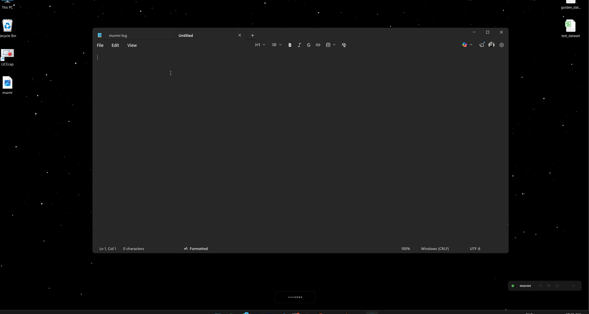

<p align="center">
  
</p>

<p align="center">
  <a href="https://www.youtube.com/@vijai_sundaram"></a>
  <a href="https://www.linkedin.com/in/vijay-sundaram/"></a>
  <a href="https://x.com/VijaySundaram_"></a>
  
  
  
</p>

---

## The free, local Wispr Flow for Windows.

Press a key, speak, paste — local voice dictation for Windows. No cloud, no subscription. Everything runs on your machine: transcription, AI cleanup, and optional Notion logging.

---

## Demo

<p align="center">
  
</p>

<p align="center">
  <a href="YOUR_YOUTUBE_VIDEO_URL">▶️ Watch the full build on YouTube</a>
</p>

---

## Features

- **Hotkey-driven** — `Ctrl+Win` to toggle hands-free recording; hold `Ctrl+Alt+Win` for push-to-talk
- **100% local transcription** — powered by faster-whisper; your audio never leaves your machine, zero cost per use
- **Parallel transcription** — silence detection splits speech into segments mid-recording; background threads transcribe each chunk as you speak, so only the final segment waits on stop
- **AI cleanup** — optional pass to strip fillers, fix grammar, and handle self-corrections via OpenAI or a local Ollama model
- **Floating dock** — draggable always-on-top pill showing live status; collapses to stay out of your way; position persists across restarts
- **System tray** — quiet background presence with a right-click menu for quick toggles
- **Notion logging** — optionally appends every transcription to a Notion page with a timestamp
- **Settings GUI** — full configuration window; no `.env` editing required

---

## Architecture

```
Hotkey press
    └── recorder.py       starts mic stream, emits silence-split segments to queue
         └── main.py      segment worker transcribes each chunk in a background thread
              └── transcriber.py    faster-whisper inference
                   └── ai_cleaner.py    (optional) filler/grammar cleanup via OpenAI or Ollama
                        └── main.py    paste at cursor via clipboard + Ctrl+V
                             └── notion_writer.py    (optional) append to Notion page
```

On stop, only the final (unfinished) segment remains to be transcribed — everything before it is already done.

---

## Tech Stack

| Tool | Purpose |
|------|---------|
| `faster-whisper` | Local speech-to-text inference — runs entirely on your machine |
| `pynput` | Global hotkey listener — works across all Windows apps |
| `sounddevice` | Mic capture + live RMS level for the animated waveform |
| `pyperclip` | Clipboard copy/paste |
| `pystray` | System tray icon and menu |
| `tkinter` | Floating overlay, dock widget, and settings window |
| `Pillow` | Draws the tray icon "M" lettermark in memory — no icon file needed |
| `python-dotenv` | Loads settings from `.env` |
| `numpy` | Raw audio buffer handling |
| `openai` | AI cleanup via OpenAI API (optional) |
| `notion-client` | Appends transcriptions to a Notion page (optional) |

---

## Folder Structure

```
murmr/
├── murmr.bat               — launcher (double-click; no terminal window)
├── README.md
└── src/
    ├── main.py             — orchestration: tray, overlay, recording flow
    ├── dock.py             — floating dock widget
    ├── hotkeys.py          — global hotkey listener (pynput)
    ├── recorder.py         — mic capture + silence-based segment splitting
    ├── transcriber.py      — faster-whisper wrapper
    ├── ai_cleaner.py       — AI cleanup (OpenAI + Ollama)
    ├── notion_writer.py    — Notion page appender
    ├── settings_window.py  — settings GUI + .env read/write
    ├── config.py           — loads .env, exports all settings
    ├── .env                — your secrets and preferences (never commit this)
    ├── .env.example        — safe template
    └── requirements.txt    — Python dependencies
```

---

## Getting Started

**Prerequisites**
- Windows 10 or 11
- Python 3.10+
- A microphone

**Clone and install**

```bash
git clone https://github.com/v1jaysundaram/murmr.git
cd murmr
python -m venv .venv
.venv\Scripts\activate
pip install -r src/requirements.txt
```

**Configure**

```bash
copy src\.env.example src\.env
```

Open `src\.env` and set at minimum:

```
WHISPER_MODEL=small   # tiny | base | small
```

Everything else is optional — AI cleanup, Notion logging, and overlay theme are all configurable in the Settings window.

**Run**

```bash
cd src
python main.py
```

Or just double-click `murmr.bat` — no terminal window.

> **First run:** faster-whisper downloads model weights (~500 MB for `small`). This only happens once.

**Auto-start on login:** `Win+R` → `shell:startup` → drop a shortcut to `murmr.bat`

---

## Usage

| Action | How |
|--------|-----|
| Start recording | `Ctrl+Win` |
| Stop and paste | `Ctrl+Win` again |
| Push-to-talk | Hold `Ctrl+Alt+Win`, release to transcribe |
| Toggle Notion logging | Click `[N]` on dock, or tray → Notion logging |
| Toggle AI cleanup | Click `[AI]` on dock, or tray → AI cleanup |
| Open settings | Click `[⚙]` on dock, or tray → Settings |
| Collapse dock | Click `[–]` on dock |
| Quit | Click `[✕]` on dock, or tray → Quit |

---

## Why I Built This

<!-- Add your personal motivation here -->

---

## License

MIT © Vijay Sundaram Mohana

---

## Connect

<p align="center">
  <a href="https://www.youtube.com/@vijai_sundaram">YouTube</a> &nbsp;·&nbsp; <a href="https://www.linkedin.com/in/vijay-sundaram/">LinkedIn</a> &nbsp;·&nbsp; <a href="https://x.com/VijaySundaram_">X</a>
</p>
